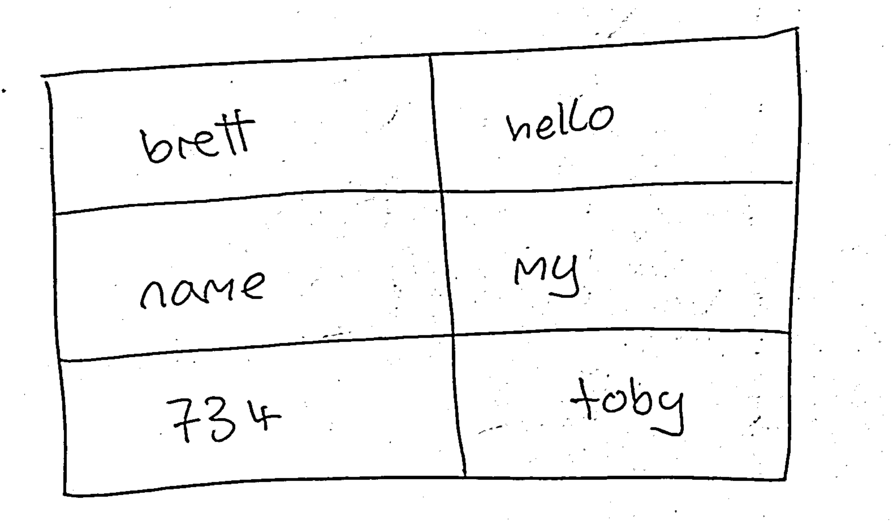
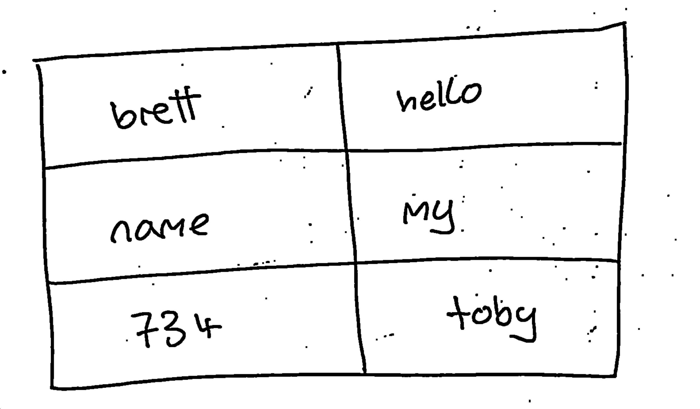
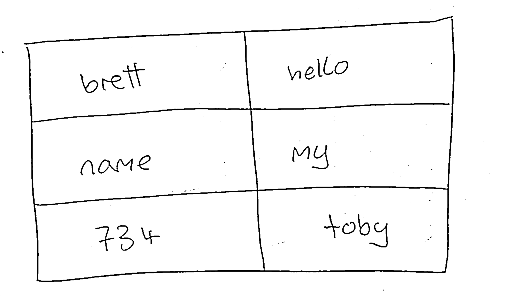
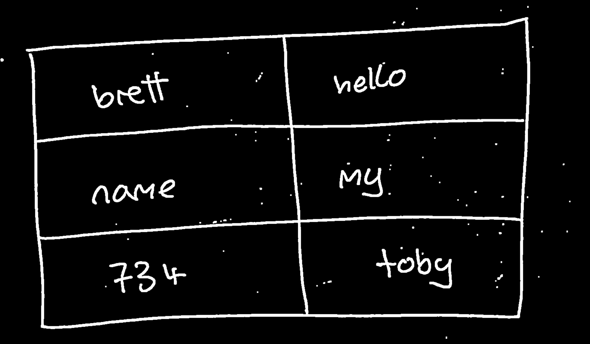
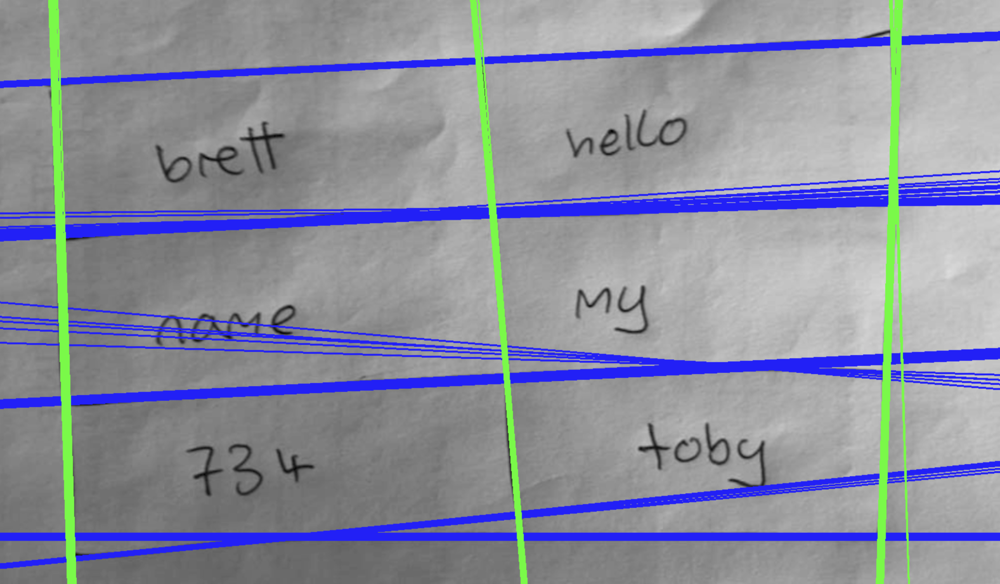
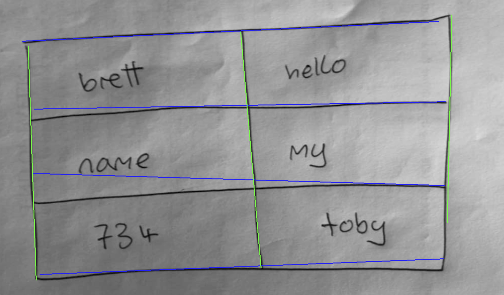
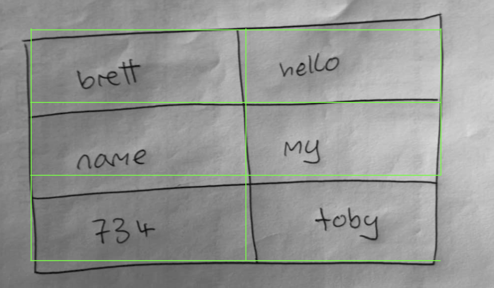

# NotesToLatex *(unfinished)*

## What does it do?
Aims to take a handwritten page of notes and convert it into LaTeX. Currently only has **TableToLatex**, which takes a hand-drawn table (with text) and converts it into a LaTeX table.

# Examples
| Output \| Input |
|-------|


I used a pretrained OCR model for text recognition (terrible results, but just a placeholder — my main focus was the table backbone). If I were to continue this project I would certainly train a better one myself.

# Pipeline

**Raw image:**


**1. Gaussian blur** to smooth the image:
```python
blurred = cv2.GaussianBlur(image, (5, 5), 2)
```


**2. Adaptive threshold** so the image is all black or white:
```python
threshold = cv2.adaptiveThreshold(median, 255, cv2.ADAPTIVE_THRESH_MEAN_C, cv2.THRESH_BINARY, 7, 3)
```


**3. Dilation** to connect any broken table segments:
```python
dilated = cv2.dilate(threshold, kernelD, iterations=1)
```


**4. Erosion** to remove noise:
```python
eroded = cv2.erode(dilated, kernelE, iterations=1)
```


**5. Invert** so OpenCV can run HoughLines:



**6. Line detection** with HoughLinesP:
```python
lines = cv2.HoughLinesP(processed,
                        1,
                        np.pi / 180,
                        threshold,
                        minLineLength=minLineLength,
                        maxLineGap=1)
```


**7. Line filtering:**



**8. Table construction:**



**9. LaTeX output:**
```latex
\documentclass{article}
\usepackage{multirow}
\usepackage{booktabs}
\begin{document}
\begin{table}[h]
\centering
\begin{tabular}{|l|l|}
\hline
\verb|street ,|&\verb|" Mexico|\\
\hline
\verb|Because it|&\verb|forces in the|\\
\hline
\verb|Texas State|&\verb|2 October 1987|\\
\hline
\end{tabular}
\end{table}
\end{document}
```
